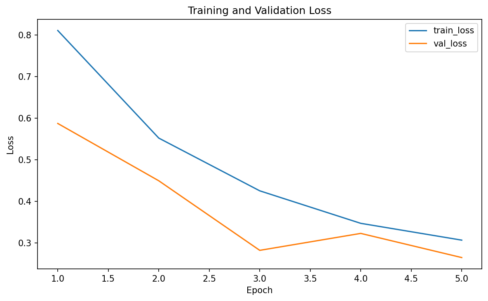
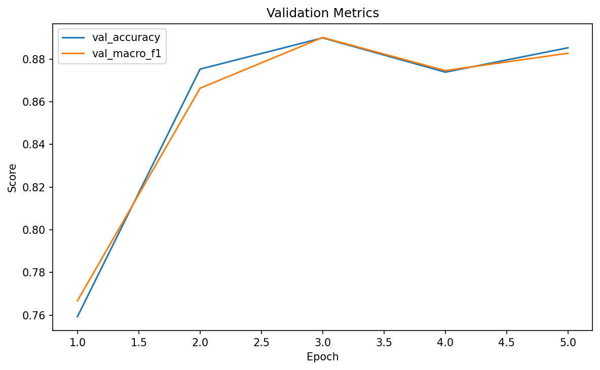
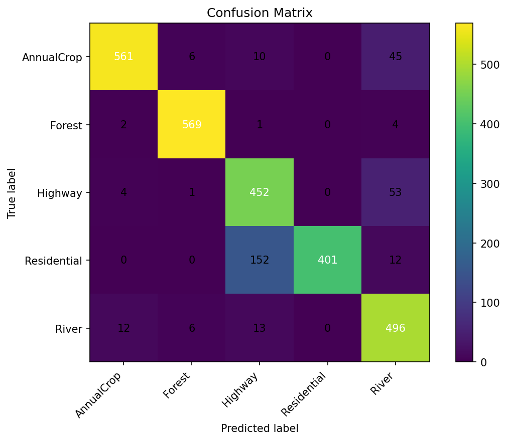

# LoRA Vision Transformer for EuroSAT Land-Use Classification

A satellite image classification pipeline on **EuroSAT** using a **LoRA-fine-tuned Vision Transformer**, with substantial **OpenCV** and **SciPy** feature engineering, training metrics/plots, and a **FastAPI** inference service.

## Features

- **LoRA fine-tuning** on a pretrained Vision Transformer
- **EuroSAT dataset support**
- **OpenCV-based feature engineering**
- **SciPy-based filtering, smoothing, and class weighting**
- **7-channel model input** instead of plain RGB
- **Training & confusion matrix plots** saved as PNG files
- **CSV training log** saved per epoch
- **FastAPI inference endpoint**
- **Docker support**

## Tech Stack

- **PyTorch**
- **Torchvision**
- **OpenCV**
- **SciPy**
- **FastAPI**
- **Uvicorn**
- **Docker**

## Quick Start 

Install the required dependencies:
```bash 
pip3 install -r requirements.txt 
```
Download the dataset: 
```bash
curl -L -o data/EuroSAT.zip https://madm.dfki.de/files/sentinel/EuroSAT.zip
```
Unzip:
```bash
unzip -q data/EuroSAT.zip -d data
```
Train the model:
```bash
python3 -m src.train --config configs/train_config.yaml
```

## Project Structure

```text
cv-lora-classifier/
├── README.md
├── Dockerfile
├── requirements.txt
├── configs/
│   └── train_config.yaml
├── data/
│   └── .gitkeep
├── outputs/
│   └── .gitkeep
└── src/
    ├── train.py
    ├── infer.py
    ├── api/
    │   └── main.py
    ├── data/
    │   ├── eurosat_opencv.py
    │   ├── transforms.py
    │   └── feature_engineering.py
    ├── models/
    │   ├── lora.py
    │   └── vit_lora.py
    └── utils/
        ├── io.py
        ├── metrics.py
        ├── plots.py
        ├── visualization.py
        └── scipy_utils.py
```

## Dataset

This project uses the **EuroSAT** dataset. 

EuroSAT is a remote sensing land-use and land-cover image dataset commonly used for satellite image classification.

Typical classes include:

- AnnualCrop
- Forest
- HerbaceousVegetation
- Highway
- Industrial
- Pasture
- PermanentCrop
- Residential
- River
- SeaLake

You can train on:
- all classes, or
- a selected subset by editing `selected_classes` in the config

## Inference

Run:

```bash
python3 -m src.infer \
  --checkpoint outputs/best_model.pt \
  --output_dir outputs/predictions
```

## API 

This project includes a FastAPI app for serving predictions. 

Start the API

```bash
python3 -m uvicorn src.api.main:app --reload --host 0.0.0.0 --port 8000
```

## API Docs 

Once the server is running, open:
```
http://127.0.0.1:8000/docs
```

## API Request

Sample request: 

```
curl -X POST "http://127.0.0.1:8000/predict" \
  -H "accept: application/json" \
  -F "file=@data/2750/Forest/Forest_1.jpg"
```

Response:

```json
{
  "predicted_class": "Forest",
  "confidence": 0.9919,
  "class_probabilities": {
    "AnnualCrop": 0.0002,
    "Forest": 0.9919,
    "Highway": 0.0002,
    "Residential": 0.0000,
    "River": 0.0077
  }
}
```

## Docker

Build the image:

```bash
docker build -t cv-lora-classifier .
```

Run the API: 

```bash
docker run --rm -p 8000:8000 -v "$(pwd)/outputs:/app/outputs" cv-lora-classifier
```

Training: 

```bash
docker run --rm \
  -v "$(pwd)/data:/app/data" \
  -v "$(pwd)/outputs:/app/outputs" \
  cv-lora-classifier \
  python src/train.py --config configs/train_config.yaml
```

Inference: 

```bash
docker run --rm \
  -v "$(pwd)/data:/app/data" \
  -v "$(pwd)/outputs:/app/outputs" \
  cv-lora-classifier \
  python src/infer.py --checkpoint outputs/best_model.pt --output_dir outputs/predictions
```

## Training Curve Results




The training curves show that the model learns quickly and reaches strong validation performance within the first few epochs.

### Loss curve

Both training and validation loss decrease substantially over the course of training:

- training loss falls from about **0.81** to **0.31**
- validation loss falls from about **0.59** to **0.27**

This indicates that the model is learning meaningful class distinctions rather than memorizing noise. Validation loss remains below training loss throughout training, which is consistent with a stable regularized setup and suggests that the LoRA-based fine-tuning is not overfitting aggressively.

There is a small increase in validation loss around **epoch 4**, but the curve improves again by **epoch 5**, so this looks more like normal epoch-to-epoch variation than a sign of sustained overfitting.

### Validation metrics

Validation performance improves sharply in the first few epochs:

- validation accuracy rises from about **0.76** to **0.89**
- validation macro F1 rises from about **0.77** to **0.88**

The largest improvement happens between **epochs 1 and 2**, which suggests that the pretrained ViT adapts quickly to the EuroSAT classification task when combined with LoRA and engineered OpenCV/SciPy features.

After **epoch 3**, the curves flatten, which suggests the model is approaching convergence. There is a slight dip at **epoch 4**, followed by recovery at **epoch 5**, indicating generally stable validation behavior.

### Overall takeaway

The training curves suggest that the model converges efficiently, achieves strong validation performance, and shows no major signs of unstable optimization or severe overfitting over the 5-epoch run. Most of the useful learning happens early, with later epochs providing smaller refinements.

## Confusion Matrix Results



The confusion matrix shows that the model performs strongly on most EuroSAT classes, with the clearest results on **Forest**, **AnnualCrop**, and **River**.

### Key observations

- **Forest** is classified very accurately, with **569 correct predictions** and very few errors.
- **AnnualCrop** is also strong, with **561 correct predictions**, though it is sometimes confused with **River**.
- **River** performs well with **496 correct predictions**, but some river scenes are predicted as **Highway** or **AnnualCrop**.
- **Highway** is generally reliable with **452 correct predictions**, but it is sometimes confused with **River**.
- **Residential** is the most difficult class in this subset. Although it has **401 correct predictions**, it is frequently misclassified as **Highway** (**152 cases**).

### Main error pattern

The largest source of confusion is between **Residential** and **Highway**. This is a reasonable failure mode for satellite imagery because both classes can contain:

- dense road structure
- strong linear patterns
- similar texture and edge features

There is also some confusion between:

- **Highway** and **River**
- **AnnualCrop** and **River**

These classes can share elongated shapes, repeated patterns, and strong boundaries in aerial views.

### Overall takeaway

The model has a strong diagonal pattern in the confusion matrix, which means it is learning meaningful class distinctions. Most classes are predicted accurately, but visually similar land-use types still create errors, especially **Residential vs Highway**.

This result suggests that the LoRA-tuned ViT plus OpenCV/SciPy feature engineering is effective, while still leaving room for improvement on classes with overlapping spatial structure.


## Inference Results

Sample inference outputs on EuroSAT images were generally high-confidence and consistent with the trained land-use categories. For example, several test images were predicted as **AnnualCrop** with strong confidence, including **0.9368**, **0.9946**, and **0.9879**. Additional examples also showed confident **AnnualCrop** predictions at **0.9032**, **0.9930**, **0.9720**, **0.9904**, and **0.9829**.  

One sample was classified as **River** with confidence **0.8685**, showing that the model can also separate water-related land-cover patterns from the other categories in the subset.

One lower-confidence prediction of **AnnualCrop** at **0.5764** suggests that some images remain more ambiguous, which is consistent with the confusion matrix results and the visual similarity between certain EuroSAT classes.

### Overall Takeaway

These results suggest that the LoRA-tuned Vision Transformer, combined with OpenCV/SciPy feature engineering, learns useful remote-sensing representations with relatively little fine-tuning. The model performs best on visually distinct classes and is less certain on classes with overlapping spatial structure and texture.

